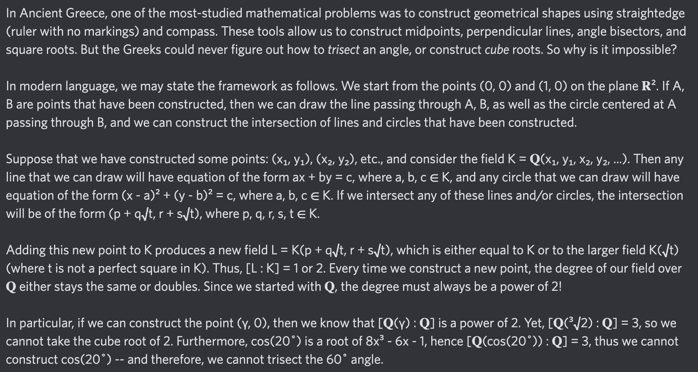

# Equation of The Day

# Day 79: [Constructible number](https://en.wikipedia.org/wiki/Constructible_number)

$$[\mathbb Q(\gamma):\mathbb Q]=2^k$$

<picture></picture>

<a href="archive/64-127/0078.html">#78</a> $\qquad\leftarrow\qquad$ #79 (November 13, 2024)

# About

This is the website for the EoTD (Equation of The Day), by Zongshu Wu. Every day, I post a mathematical expression (usually an equation), and then give a brief explanation. Together, all of the EoTDs form a coherent whole, a guide to advanced mathematics.

The length of this series may seem to clash with the subtitle of "A brief guide to higher math" -- but this is only because there is an immense amount of math out there! Relative to other sources, this series is meant to be short, yet still provide key mathematical intuitions.

Let $0\in\mathbb N$.

## [Sector 1: Days 1 - 63](archive/0-63.md)

  &nbsp;<a href="archive/0-63/0000.html">&nbsp;</a>
  &nbsp;&nbsp;<a href="archive/0-63/0001.html">1</a>
  &nbsp;&nbsp;<a href="archive/0-63/0002.html">2</a>
  &nbsp;&nbsp;<a href="archive/0-63/0003.html">3</a>
  &nbsp;&nbsp;<a href="archive/0-63/0004.html">4</a>
  &nbsp;&nbsp;<a href="archive/0-63/0005.html">5</a>
  &nbsp;&nbsp;<a href="archive/0-63/0006.html">6</a>
  &nbsp;&nbsp;<a href="archive/0-63/0007.html">7</a> 
  &nbsp;<a href="archive/0-63/0008.html">8</a>
  &nbsp;&nbsp;<a href="archive/0-63/0009.html">9</a>
  &nbsp;<a href="archive/0-63/0010.html">10</a>
  &nbsp;<a href="archive/0-63/0011.html">11</a>
  &nbsp;<a href="archive/0-63/0012.html">12</a>
  &nbsp;<a href="archive/0-63/0013.html">13</a>
  &nbsp;<a href="archive/0-63/0014.html">14</a>
  &nbsp;<a href="archive/0-63/0015.html">15</a> 
  <a href="archive/0-63/0016.html">16</a>
  &nbsp;<a href="archive/0-63/0017.html">17</a>
  &nbsp;<a href="archive/0-63/0018.html">18</a>
  &nbsp;<a href="archive/0-63/0019.html">19</a>
  &nbsp;<a href="archive/0-63/0020.html">20</a>
  &nbsp;<a href="archive/0-63/0021.html">21</a>
  &nbsp;<a href="archive/0-63/0022.html">22</a>
  &nbsp;<a href="archive/0-63/0023.html">23</a> 
  <a href="archive/0-63/0024.html">24</a>
  &nbsp;<a href="archive/0-63/0025.html">25</a>
  &nbsp;<a href="archive/0-63/0026.html">26</a>
  &nbsp;<a href="archive/0-63/0027.html">27</a>
  &nbsp;<a href="archive/0-63/0028.html">28</a>
  &nbsp;<a href="archive/0-63/0029.html">29</a>
  &nbsp;<a href="archive/0-63/0030.html">30</a>
  &nbsp;<a href="archive/0-63/0031.html">31</a> 
  <a href="archive/0-63/0032.html">32</a>
  &nbsp;<a href="archive/0-63/0033.html">33</a>
  &nbsp;<a href="archive/0-63/0034.html">34</a>
  &nbsp;<a href="archive/0-63/0035.html">35</a>
  &nbsp;<a href="archive/0-63/0036.html">36</a>
  &nbsp;<a href="archive/0-63/0037.html">37</a>
  &nbsp;<a href="archive/0-63/0038.html">38</a>
  &nbsp;<a href="archive/0-63/0039.html">39</a> 
  <a href="archive/0-63/0040.html">40</a>
  &nbsp;<a href="archive/0-63/0041.html">41</a>
  &nbsp;<a href="archive/0-63/0042.html">42</a>
  &nbsp;<a href="archive/0-63/0043.html">43</a>
  &nbsp;<a href="archive/0-63/0044.html">44</a>
  &nbsp;<a href="archive/0-63/0045.html">45</a>
  &nbsp;<a href="archive/0-63/0046.html">46</a>
  &nbsp;<a href="archive/0-63/0047.html">47</a> 
  <a href="archive/0-63/0048.html">48</a>
  &nbsp;<a href="archive/0-63/0049.html">49</a>
  &nbsp;<a href="archive/0-63/0050.html">50</a>
  &nbsp;<a href="archive/0-63/0051.html">51</a>
  &nbsp;<a href="archive/0-63/0052.html">52</a>
  &nbsp;<a href="archive/0-63/0053.html">53</a>
  &nbsp;<a href="archive/0-63/0054.html">54</a>
  &nbsp;<a href="archive/0-63/0055.html">55</a> 
  <a href="archive/0-63/0056.html">56</a>
  &nbsp;<a href="archive/0-63/0057.html">57</a>
  &nbsp;<a href="archive/0-63/0058.html">58</a>
  &nbsp;<a href="archive/0-63/0059.html">59</a>
  &nbsp;<a href="archive/0-63/0060.html">60</a>
  &nbsp;<a href="archive/0-63/0061.html">61</a>
  &nbsp;<a href="archive/0-63/0062.html">62</a>
  &nbsp;<a href="archive/0-63/0063.html">63</a>

In the very first sector of the EoTD, we explore the basics of higher math: abstract algebra, linear algebra, and real analysis. Even at the basic level, there are many connections between the algebraic and the analytic, so to introduce everything effectively, I have decided to group the EoTDs into sections of 8 or 16 days, with the topic alternating between algebra and analysis.

1 - 15: Ring Theory

16 - 23: Real Analysis

24 - 31: Rings and Groups

32 - 39: Real Analysis

40 - 47: Linear Algebra

48 - 63: Various Topics in Analysis

## [Sector 2: Days 64 - 127](archive/64-127.md)

In progress!

  <a href="archive/64-127/0064.html">64</a>
  &nbsp;<a href="archive/64-127/0065.html">65</a>
  &nbsp;<a href="archive/64-127/0066.html">66</a>
  &nbsp;<a href="archive/64-127/0067.html">67</a>
  &nbsp;<a href="archive/64-127/0068.html">68</a>
  &nbsp;<a href="archive/64-127/0069.html">69</a>
  &nbsp;<a href="archive/64-127/0070.html">70</a>
  &nbsp;<a href="archive/64-127/0071.html">71</a> 
  <a href="archive/64-127/0072.html">72</a>
  &nbsp;<a href="archive/64-127/0073.html">73</a>
  &nbsp;<a href="archive/64-127/0074.html">74</a>
  &nbsp;<a href="archive/64-127/0075.html">75</a>
  &nbsp;<a href="archive/64-127/0076.html">76</a>
  &nbsp;<a href="archive/64-127/0077.html">77</a>
  &nbsp;<a href="archive/64-127/0078.html">78</a>
  &nbsp;<a href="archive/64-127/0079.html">79</a>

64 - 71: Set Theory

72 - 79: Field Theory and Galois Theory

80 - 87: Point-Set Topology

