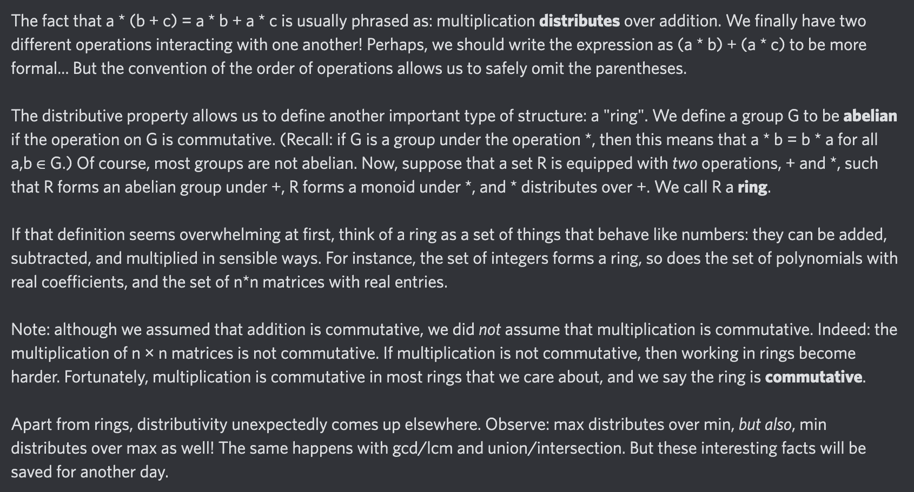

# Equation of The Day

# Day 5: [Distributivity](https://en.wikipedia.org/wiki/Distributive_property) (see also [Ring](https://en.wikipedia.org/wiki/Ring_(mathematics)))

$$a*(b+c)=a*b+a*c$$

<picture></picture>

<a href="0004.html">#4</a> $\qquad\leftarrow\qquad$ #5 (June 5, 2024) $\qquad\rightarrow\qquad$ <a href="0006.html">#6</a>

[Back to Sector 1](../0-63.md)

