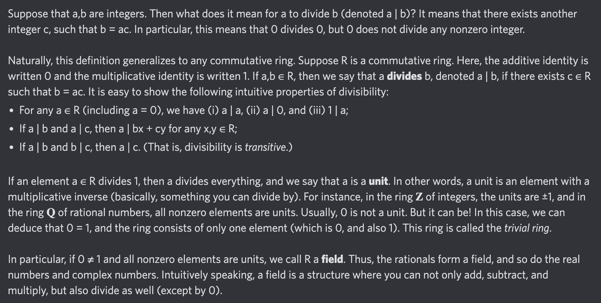

# Equation of The Day

# Day 6: [Divisibility](https://en.wikipedia.org/wiki/Divisibility_(ring_theory))

$$\exists c,b=ac$$

<picture></picture>

<a href="0005.html">#5</a> $\qquad\leftarrow\qquad$ #6 (June 6, 2024) $\qquad\rightarrow\qquad$ <a href="0007.html">#7</a>

[Back to Sector 1](../0-63.md)

