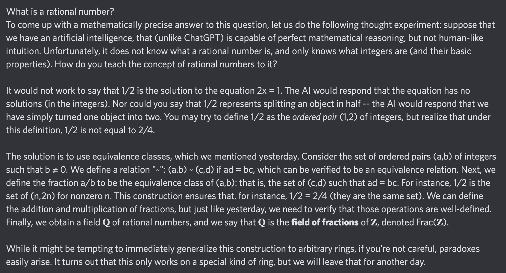

# Equation of The Day

# Day 8: [Field of fractions](https://en.wikipedia.org/wiki/Field_of_fractions)

$$\mathbb Q=\operatorname{Frac}(\mathbb Z)$$

<picture></picture>

<a href="0007.html">#7</a> $\qquad\leftarrow\qquad$ #8 (June 8, 2024) $\qquad\rightarrow\qquad$ <a href="0009.html">#9</a>

[Back to Sector 1](../0-63.md)