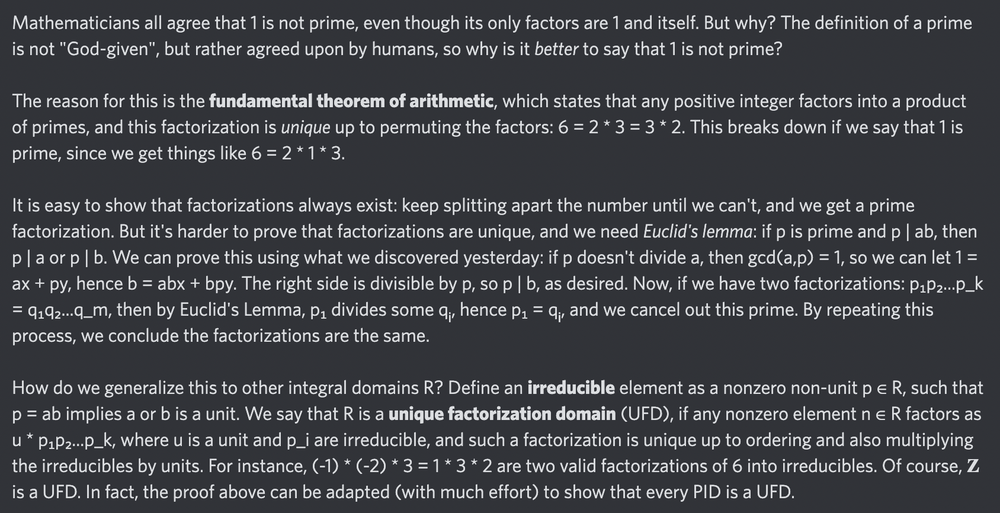

# Equation of The Day

# Day 14: [Unique factorization](https://en.wikipedia.org/wiki/Fundamental_theorem_of_arithmetic)

$$n=u\cdot p_1p_2\cdots p_k$$

<picture></picture>

<a href="0013.html">#13</a> $\qquad\leftarrow\qquad$ #14 (June 14, 2024) $\qquad\rightarrow\qquad$ <a href="0015.html">#15</a>

[Back to Sector 1](../0-63.md)

