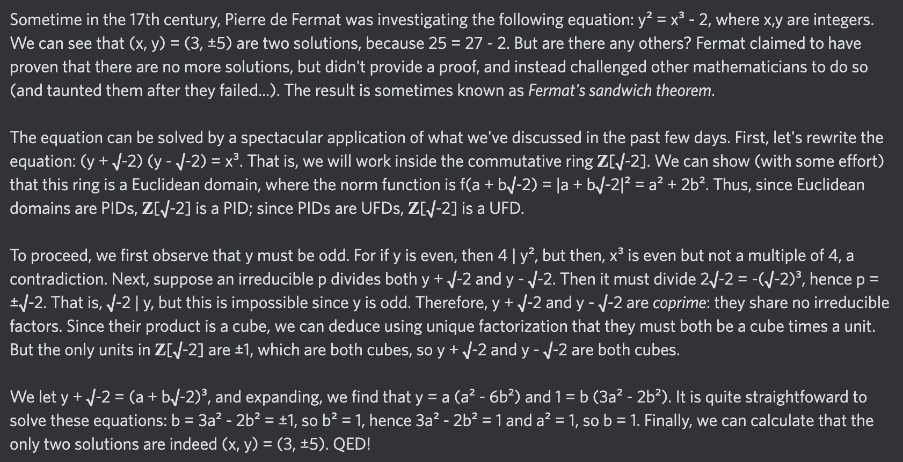

# Equation of The Day

# Day 15: [Fermat's sandwich theorem](https://mathworld.wolfram.com/FermatsSandwichTheorem.html)

$$y^2=x^3-2$$

<picture></picture>

<a href="0014.html">#14</a> $\qquad\leftarrow\qquad$ #15 (June 15, 2024) $\qquad\rightarrow\qquad$ <a href="0016.html">#16</a>

[Back to Sector 1](../0-63.md)