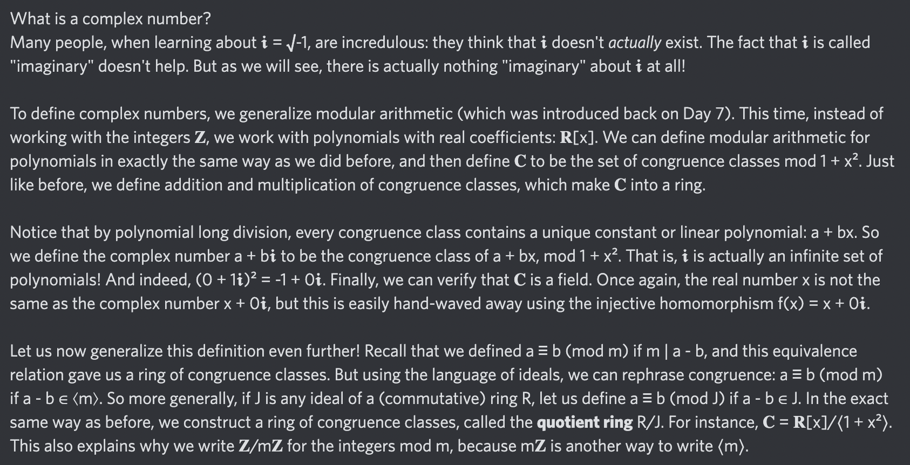

# Equation of The Day

# Day 24: [Quotient ring](https://en.wikipedia.org/wiki/Quotient_ring)

$$\mathbb C=\mathbb R[x]/\langle 1+x^2\rangle$$

<picture></picture>

<a href="0023.html">#23</a> $\qquad\leftarrow\qquad$ #24 (June 24, 2024) $\qquad\rightarrow\qquad$ <a href="0025.html">#25</a>

[Back to Sector 1](../0-63.md)

