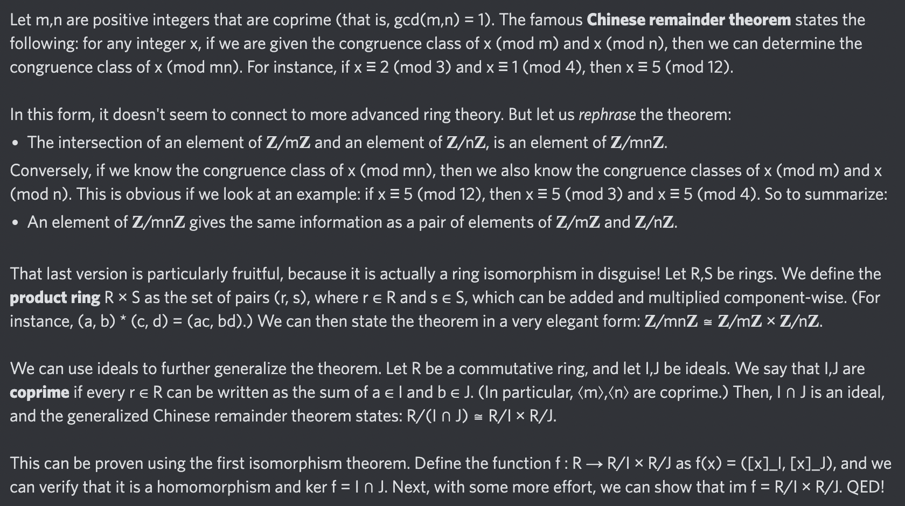

# Equation of The Day

# Day 26: [Chinese remainder theorem](https://en.wikipedia.org/wiki/Chinese_remainder_theorem)

$$R/(I\cap J)\cong R/I\times R/J$$

<picture></picture>

<a href="0025.html">#25</a> $\qquad\leftarrow\qquad$ #26 (June 26, 2024) $\qquad\rightarrow\qquad$ <a href="0027.html">#27</a>

[Back to Sector 1](../0-63.md)

