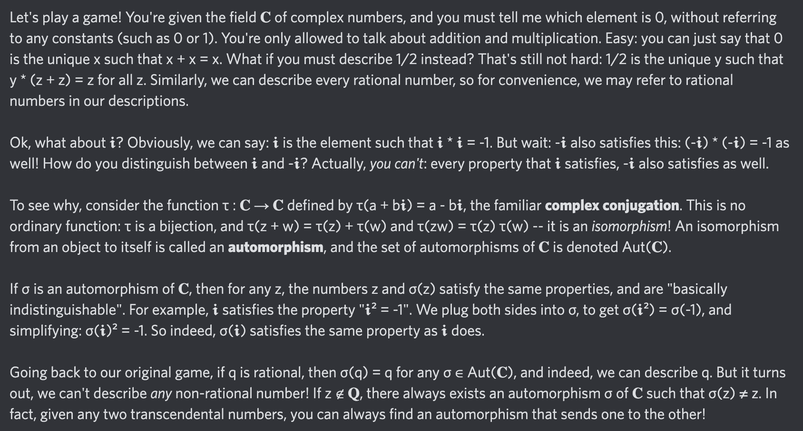

# Equation of The Day

# Day 27: [Complex conjugation](https://en.wikipedia.org/wiki/Complex_conjugate)

$$\overline{a+bi}=a-bi$$

<picture></picture>

<a href="0026.html">#26</a> $\qquad\leftarrow\qquad$ #27 (June 27, 2024) $\qquad\rightarrow\qquad$ <a href="0028.html">#28</a>

[Back to Sector 1](../0-63.md)

