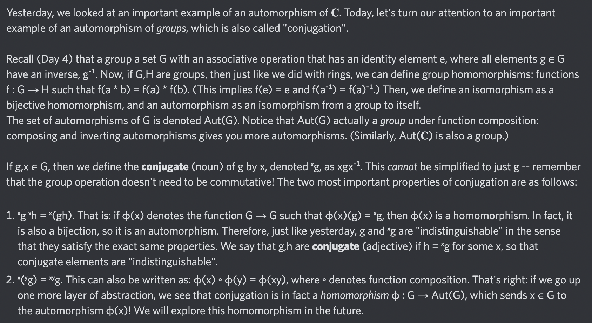

# Equation of The Day

# Day 28: [Group conjugation](https://en.wikipedia.org/wiki/Conjugacy_class)

$$^xg=xgx^{-1}$$

<picture></picture>

<a href="0027.html">#27</a> $\qquad\leftarrow\qquad$ #28 (June 28, 2024) $\qquad\rightarrow\qquad$ <a href="0029.html">#29</a>

[Back to Sector 1](../0-63.md)

