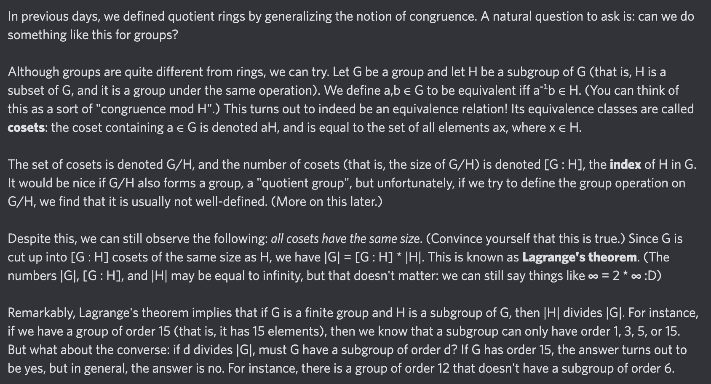

# Equation of The Day

# Day 29: [Lagrange's theorem](https://en.wikipedia.org/wiki/Lagrange%27s_theorem_(group_theory))

$$|G|=[G:H]\cdot|H|$$

<picture></picture>

<a href="0028.html">#28</a> $\qquad\leftarrow\qquad$ #29 (June 29, 2024) $\qquad\rightarrow\qquad$ <a href="0030.html">#30</a>

[Back to Sector 1](../0-63.md)

