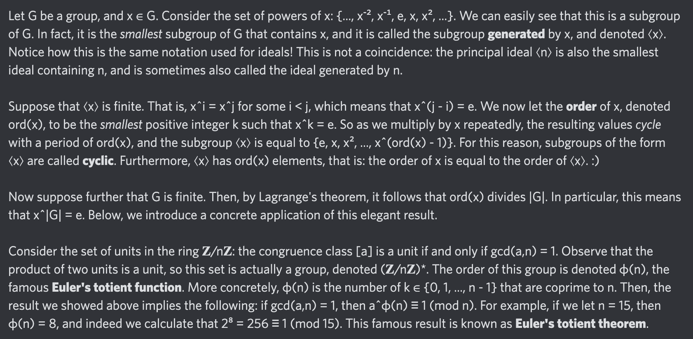

# Equation of The Day

# Day 30: [Euler's totient theorem](https://en.wikipedia.org/wiki/Euler%27s_theorem)

$$a^{\varphi(n)}\equiv1\pmod n$$

<picture></picture>

<a href="0029.html">#29</a> $\qquad\leftarrow\qquad$ #30 (July 1, 2024) $\qquad\rightarrow\qquad$ <a href="0031.html">#31</a>

[Back to Sector 1](../0-63.md)