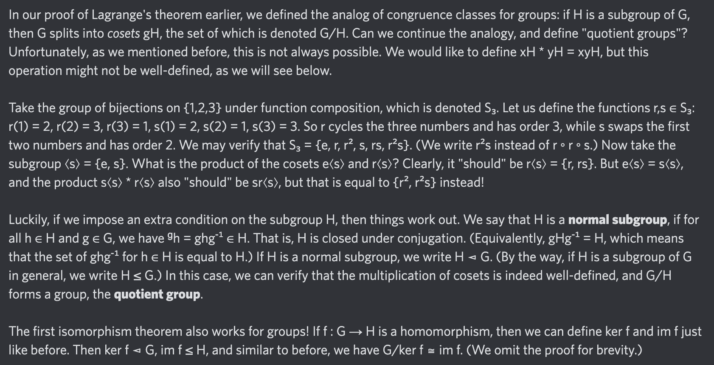

# Equation of The Day

# Day 31: [Normal subgroup](https://en.wikipedia.org/wiki/Normal_subgroup) (see also [Quotient group](https://en.wikipedia.org/wiki/Quotient_group))

$$gNg^{-1}=N$$

<picture></picture>

<a href="0030.html">#30</a> $\qquad\leftarrow\qquad$ #31 (July 2, 2024) $\qquad\rightarrow\qquad$ <a href="0032.html">#32</a>

[Back to Sector 1](../0-63.md)

