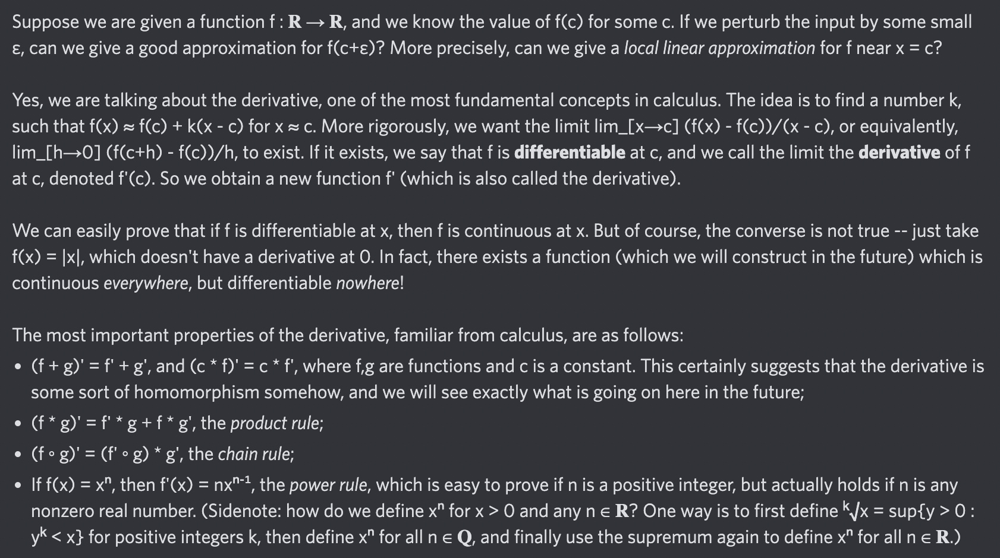

# Equation of The Day

# Day 32: [Derivative](https://en.wikipedia.org/wiki/Derivative)

$$f'(x)=\lim_{h\to0}\frac{f(x+h)-f(x)}h$$

<picture></picture>

<a href="0031.html">#31</a> $\qquad\leftarrow\qquad$ #32 (July 3, 2024) $\qquad\rightarrow\qquad$ <a href="0033.html">#33</a>

[Back to Sector 1](../0-63.md)

