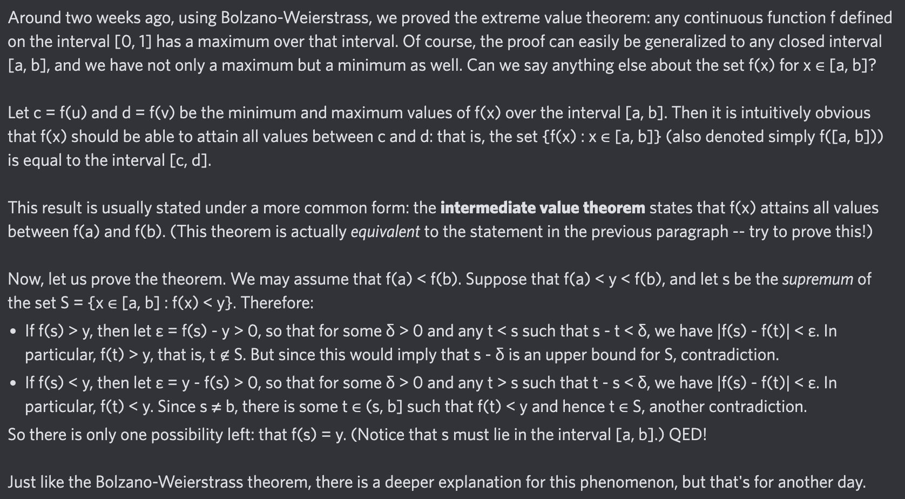

# Equation of The Day

# Day 36: [Intermediate value theorem](https://en.wikipedia.org/wiki/Intermediate_value_theorem)

$$f([a,b])=[c,d]$$

<picture></picture>

<a href="0035.html">#35</a> $\qquad\leftarrow\qquad$ #36 (July 7, 2024) $\qquad\rightarrow\qquad$ <a href="0037.html">#37</a>

[Back to Sector 1](../0-63.md)