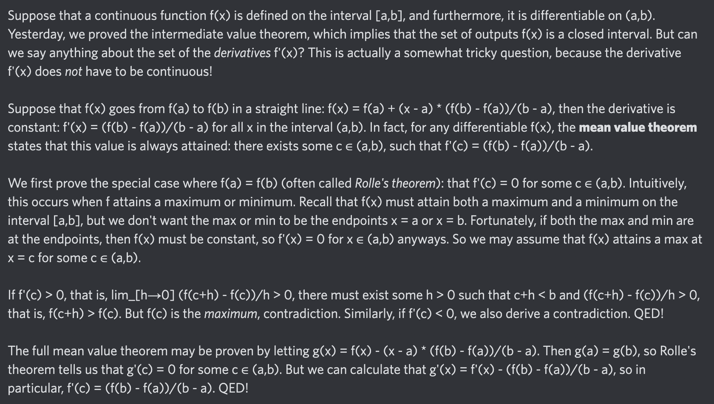

# Equation of The Day

# Day 37: [Mean value theorem](https://en.wikipedia.org/wiki/Mean_value_theorem)

$$f'(c)=\frac{f(b)-f(a)}{b-a}$$

<picture></picture>

<a href="0036.html">#36</a> $\qquad\leftarrow\qquad$ #37 (July 8, 2024) $\qquad\rightarrow\qquad$ <a href="0038.html">#38</a>

[Back to Sector 1](../0-63.md)

