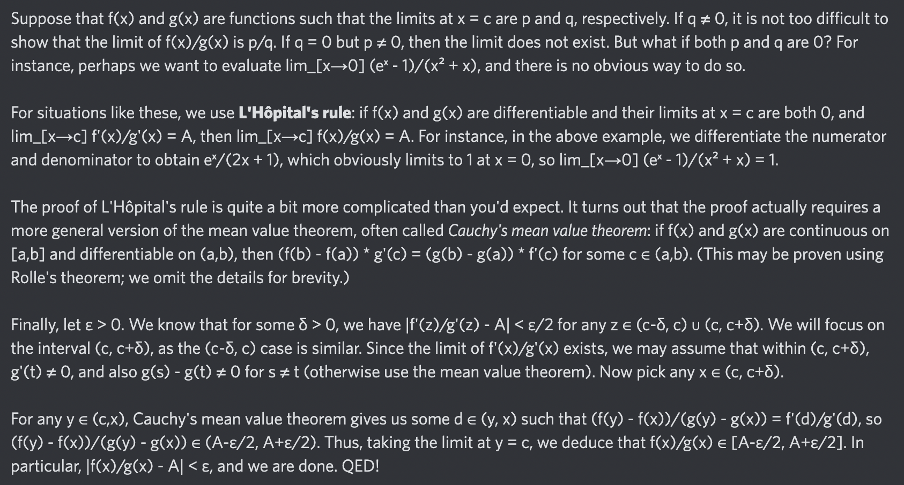

# Equation of The Day

# Day 38: [L'Hôpital's rule](https://en.wikipedia.org/wiki/L%27H%C3%B4pital%27s_rule)

$$\lim_{x\to c}\frac{f(x)}{g(x)}=\lim_{x\to c}\frac{f'(x)}{g'(x)}$$

<picture></picture>

<a href="0037.html">#37</a> $\qquad\leftarrow\qquad$ #38 (July 9, 2024) $\qquad\rightarrow\qquad$ <a href="0039.html">#39</a>

[Back to Sector 1](../0-63.md)

