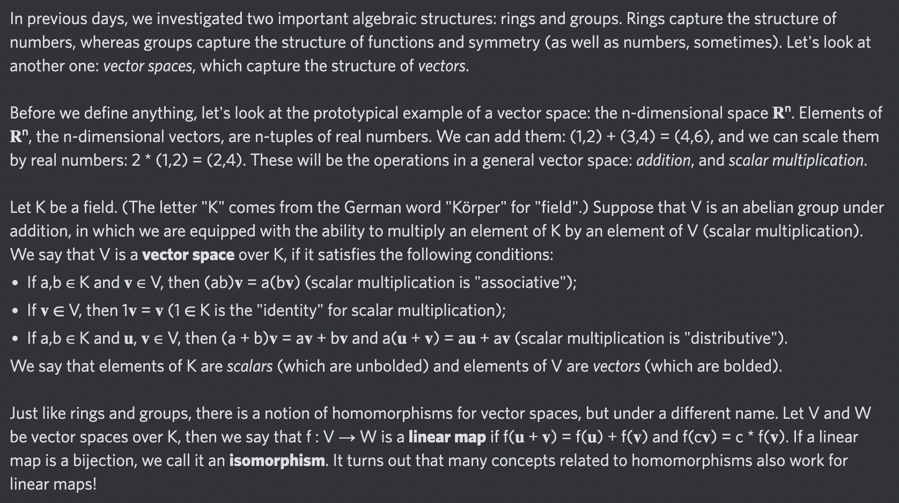

# Day 40: [Linear map](https://en.wikipedia.org/wiki/Linear_map) (see also [Vector space](https://en.wikipedia.org/wiki/Vector_space))

$$f(c\mathbf v)=cf(\mathbf v)$$

<picture></picture>

<a href="0039.html">#39</a> $\qquad\leftarrow\qquad$ #40 (July 12, 2024) $\qquad\rightarrow\qquad$ <a href="0041.html">#41</a>
