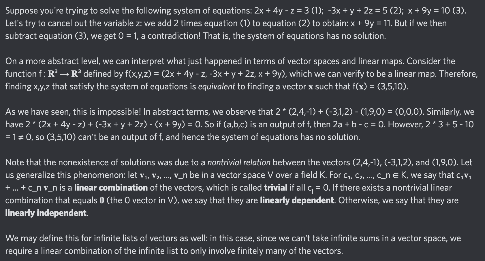

# Equation of The Day

# Day 41: [Linear independence](https://en.wikipedia.org/wiki/Linear_independence)

$$\sum_{i=1}^nc_i\mathbf{v}_i=\mathbf{0}$$

<picture></picture>

<a href="0040.html">#40</a> $\qquad\leftarrow\qquad$ #41 (July 14, 2024) $\qquad\rightarrow\qquad$ <a href="0042.html">#42</a>

[Back to Sector 1](../0-63.md)

