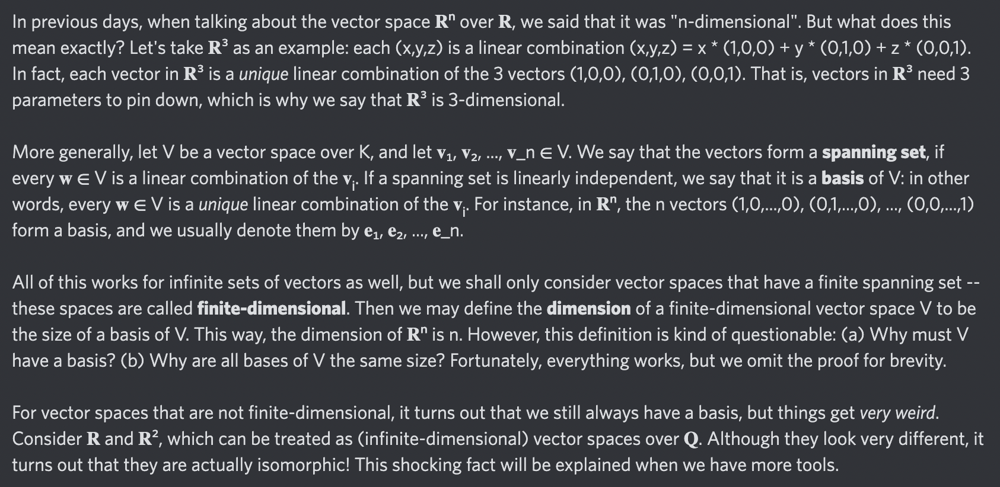

# Equation of The Day

# Day 42: [Dimension of a vector space](https://en.wikipedia.org/wiki/Dimension_(vector_space))

$$\dim V=|B|$$

<picture></picture>

<a href="0041.html">#41</a> $\qquad\leftarrow\qquad$ #42 (July 15, 2024) $\qquad\rightarrow\qquad$ <a href="0043.html">#43</a>

[Back to Sector 1](../0-63.md)

