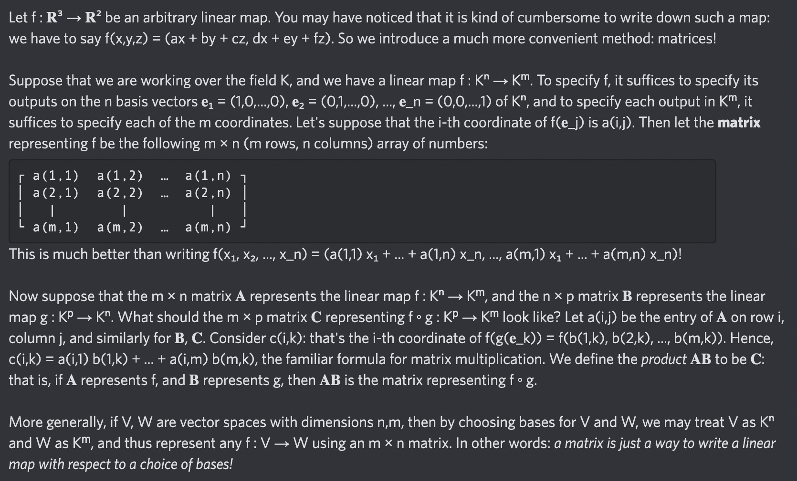

# Equation of The Day

# Day 44: [Matrix](https://en.wikipedia.org/wiki/Matrix_(mathematics))

$$c_{ik}=\sum_{j=1}^ma_{ij}b_{jk}$$

<picture></picture>

<a href="0043.html">#43</a> $\qquad\leftarrow\qquad$ #44 (July 17, 2024) $\qquad\rightarrow\qquad$ <a href="0045.html">#45</a>

[Back to Sector 1](../0-63.md)

