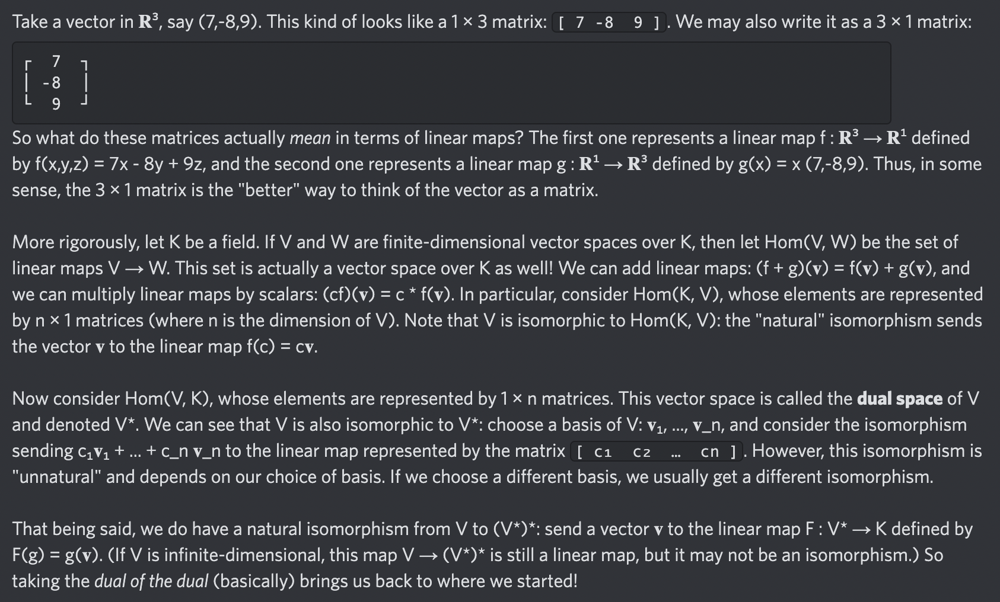

# Equation of The Day

# Day 45: [Dual space](https://en.wikipedia.org/wiki/Dual_space)

$$V^*=\operatorname{Hom}(V,K)$$

<picture></picture>

<a href="0044.html">#44</a> $\qquad\leftarrow\qquad$ #45 (July 19, 2024) $\qquad\rightarrow\qquad$ <a href="0046.html">#46</a>

[Back to Sector 1](../0-63.md)

