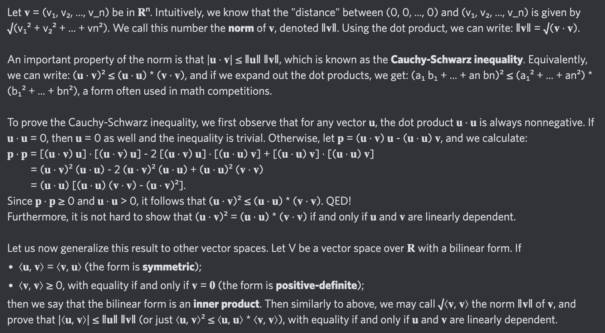

# Equation of The Day

# Day 47: [Cauchy-Schwarz inequality](https://en.wikipedia.org/wiki/Cauchy-Schwarz_inequality)

$$|\mathbf u\cdot\mathbf v|\le\|\mathbf u\|\|\mathbf v\|$$

<picture></picture>

<a href="0046.html">#46</a> $\qquad\leftarrow\qquad$ #47 (July 21, 2024) $\qquad\rightarrow\qquad$ <a href="0048.html">#48</a>

[Back to Sector 1](../0-63.md)

