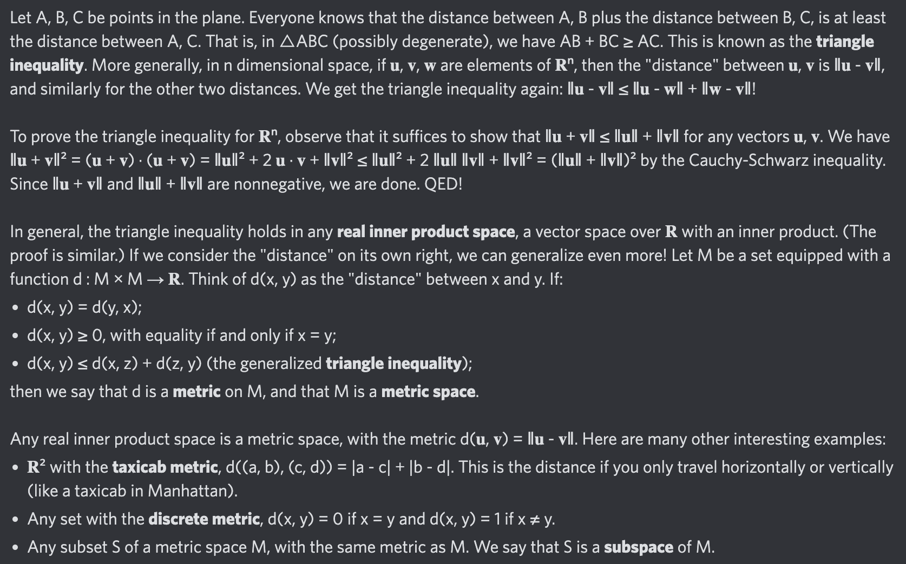

# Equation of The Day

# Day 48: [Metric space](https://en.wikipedia.org/wiki/Metric_space)

$$d(x,y)\le d(x,z)+d(z,y)$$

<picture></picture>

<a href="0047.html">#47</a> $\qquad\leftarrow\qquad$ #48 (July 22, 2024) $\qquad\rightarrow\qquad$ <a href="0049.html">#49</a>

[Back to Sector 1](../0-63.md)

