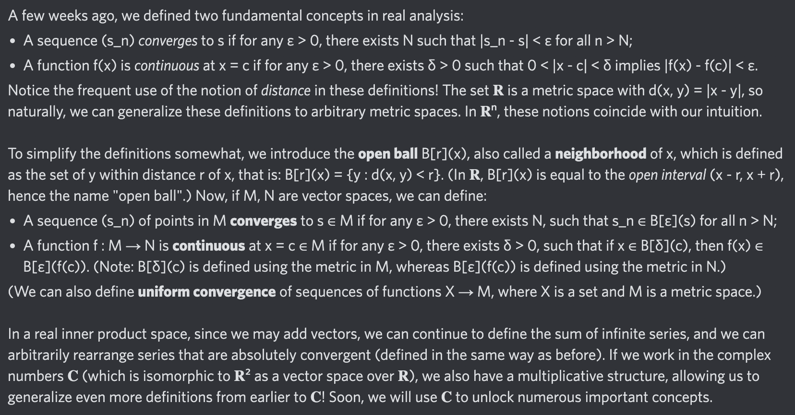

# Day 49: [Open ball](https://en.wikipedia.org/wiki/Ball_(mathematics)#In_general_metric_spaces)

$$B_r(x)=\{y:d(x,y)<r\}$$

<picture></picture>

<a href="0048.html">#48</a> $\qquad\leftarrow\qquad$ #49 (July 23, 2024) $\qquad\rightarrow\qquad$ <a href="0050.html">#50</a>
