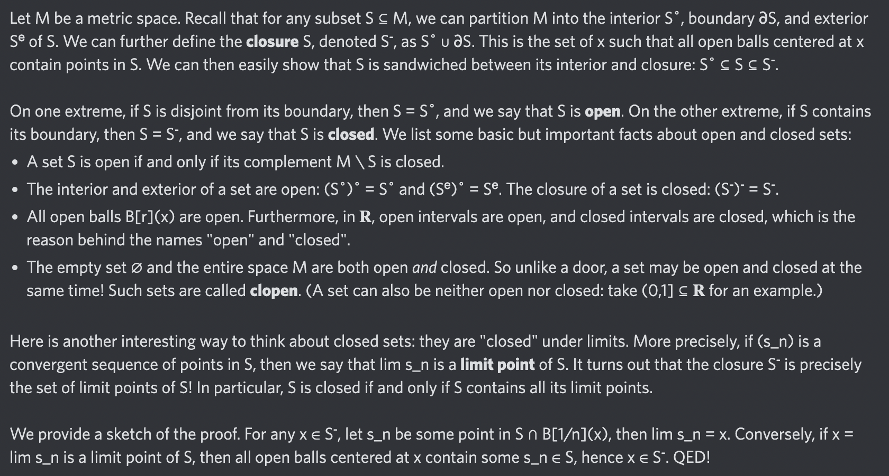

# Equation of The Day

# Day 51: [Open set](https://en.wikipedia.org/wiki/Open_set) and [Closed set](https://en.wikipedia.org/wiki/Closed_set)

$$S=S^\circ,\quad T=T^-$$

<picture></picture>

<a href="0050.html">#50</a> $\qquad\leftarrow\qquad$ #51 (July 26, 2024) $\qquad\rightarrow\qquad$ <a href="0052.html">#52</a>

[Back to Sector 1](../0-63.md)

