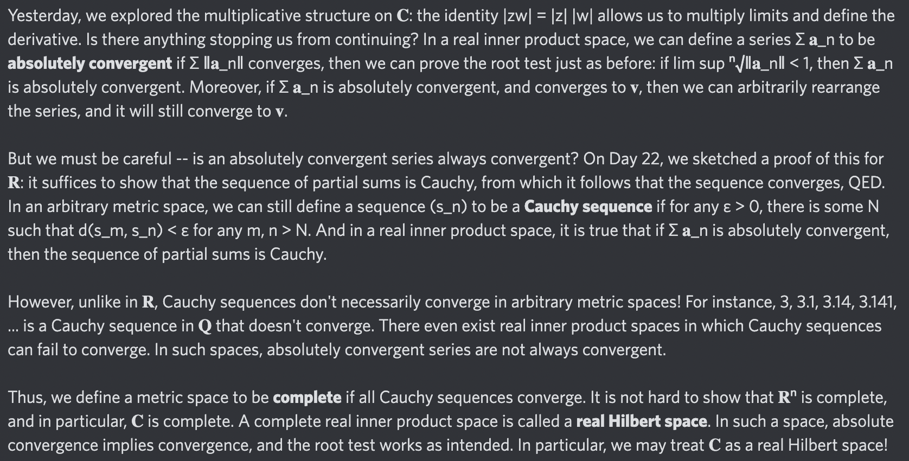

# Day 54: [Complete metric space](https://en.wikipedia.org/wiki/Complete_metric_space)

$$\forall\varepsilon>0,\exists N,\forall m,n>N,d(s_m,s_n)<\varepsilon\implies\exists s,\forall\varepsilon>0,\exists N,\forall n>N,d(s_n,s)<\varepsilon$$

<picture></picture>

<a href="0053.html">#53</a> $\qquad\leftarrow\qquad$ #54 (July 30, 2024) $\qquad\rightarrow\qquad$ <a href="0055.html">#55</a>
