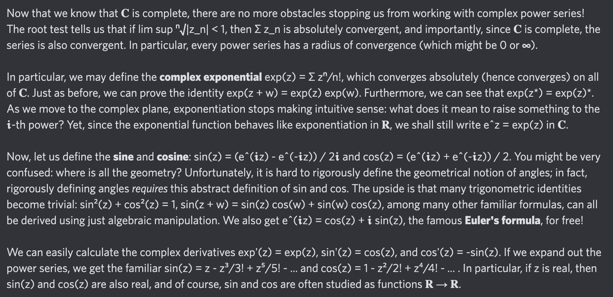

# Day 55: [Sine and cosine](https://en.wikipedia.org/wiki/Sine_and_cosine)

$$\sin z=\frac{e^{iz}-e^{-iz}}{2i},\quad\cos z=\frac{e^{iz}+e^{-iz}}2$$

<picture></picture>

<a href="0054.html">#54</a> $\qquad\leftarrow\qquad$ #55 (July 31, 2024) $\qquad\rightarrow\qquad$ <a href="0056.html">#56</a>
