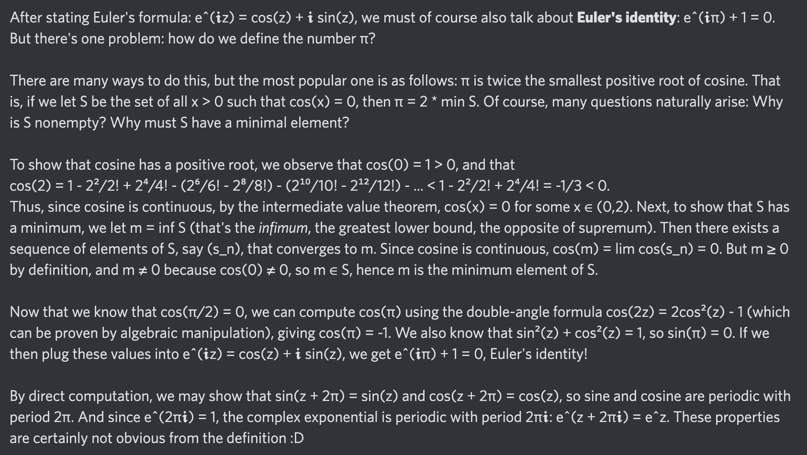

# Day 56: [Euler's identity](https://en.wikipedia.org/wiki/Euler%27s_identity) (see also [π](https://en.wikipedia.org/wiki/Pi))

$$e^{i\pi}+1=0$$

<picture></picture>

<a href="0055.html">#55</a> $\qquad\leftarrow\qquad$ #56 (August 5, 2024) $\qquad\rightarrow\qquad$ <a href="0057.html">#57</a>
