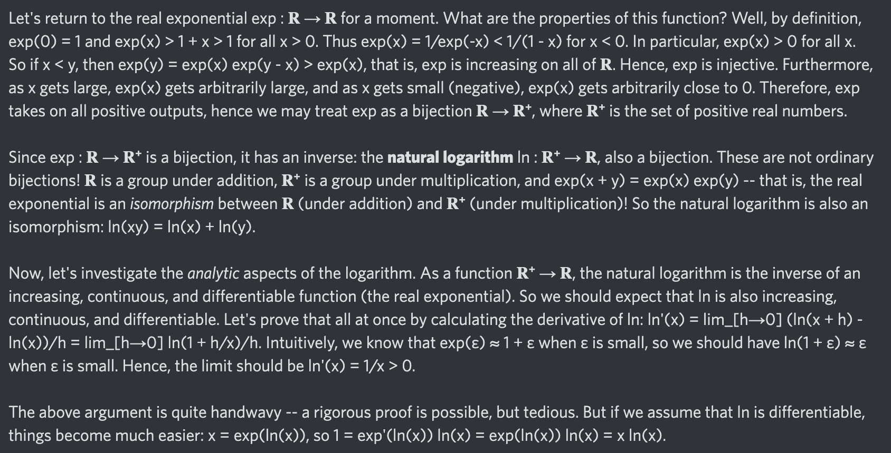

# Equation of The Day

# Day 58: [Natural logarithm](https://en.wikipedia.org/wiki/Natural_logarithm)

$$\frac{\mathrm d}{\mathrm dx}\ln x=\frac1x$$

<picture></picture>

<a href="0057.html">#57</a> $\qquad\leftarrow\qquad$ #58 (August 8, 2024) $\qquad\rightarrow\qquad$ <a href="0059.html">#59</a>

[Back to Sector 1](../0-63.md)

