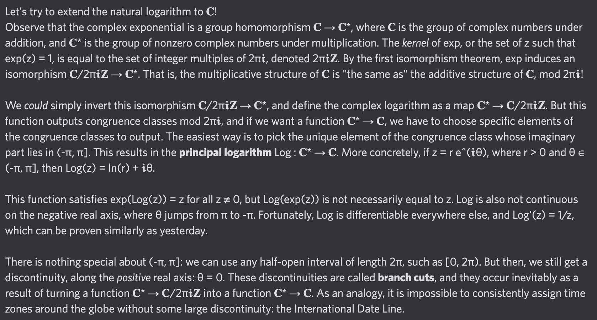

# Equation of The Day

# Day 59: [Natural logarithm](https://en.wikipedia.org/wiki/Natural_logarithm), part 2

$$\frac{\mathrm d}{\mathrm dx}\ln x=\frac1x$$

<picture></picture>

<a href="0058.html">#58</a> $\qquad\leftarrow\qquad$ #59 (August 9, 2024) $\qquad\rightarrow\qquad$ <a href="0060.html">#60</a>

[Back to Sector 1](../0-63.md)

