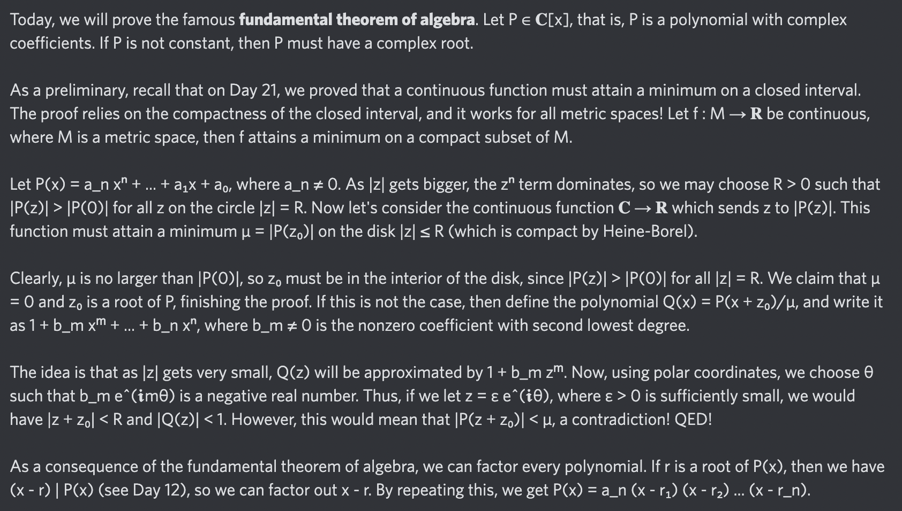

# Equation of The Day

# Day 60: [Fundamental theorem of algebra](https://en.wikipedia.org/wiki/Fundamental_theorem_of_algebra)

$$\sum_{k=0}^na_kx^k=a_n\prod_{j=1}^n(x-r_j)$$

<picture></picture>

<a href="0059.html">#59</a> $\qquad\leftarrow\qquad$ #60 (August 10, 2024)

[Back to Sector 1](../0-63.md)