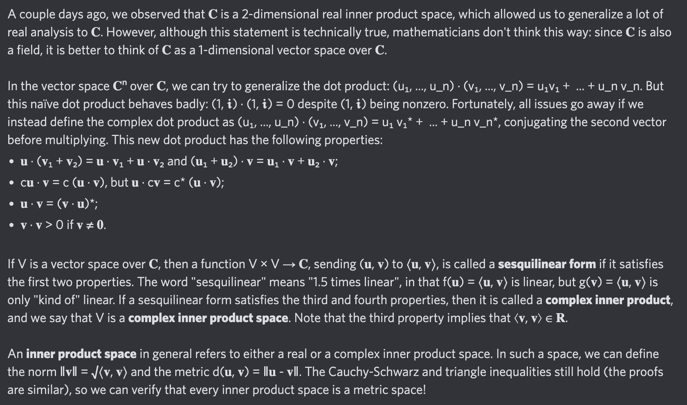

# Equation of The Day

# Day 61: [Inner product space](https://en.wikipedia.org/wiki/Inner_product_space)

$$\langle\mathbf u,c\mathbf v\rangle=\bar c\langle\mathbf u,\mathbf v\rangle$$

<picture></picture>

<a href="0060.html">#60</a> $\qquad\leftarrow\qquad$ #61 (August 11, 2024) $\qquad\rightarrow\qquad$ <a href="0062.html">#62</a>

[Back to Sector 1](../0-63.md)

