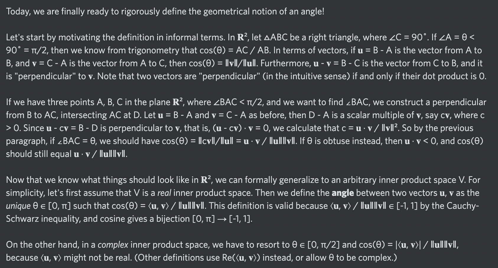

# Equation of The Day

# Day 62: [Angle](https://en.wikipedia.org/wiki/Angle#Dot_product_and_generalisations)

$$\cos\theta=\frac{\langle\mathbf u,\mathbf v\rangle}{\|\mathbf u\|\|\mathbf v\|}$$

<picture></picture>

<a href="0061.html">#61</a> $\qquad\leftarrow\qquad$ #62 (August 13, 2024) $\qquad\rightarrow\qquad$ <a href="0063.html">#63</a>

[Back to Sector 1](../0-63.md)

