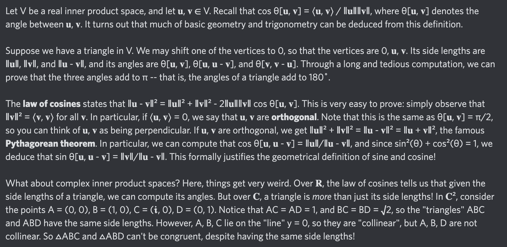

# Equation of The Day

# Day 63: [Law of cosines](https://en.wikipedia.org/wiki/Law_of_cosines)

$$\|\mathbf u-\mathbf v\|^2=\|\mathbf u\|^2+\|\mathbf v\|^2-2\|\mathbf u\|\|\mathbf v\|\cos\theta$$

<picture></picture>

<a href="0062.html">#62</a> $\qquad\leftarrow\qquad$ #63 (August 15, 2024) $\qquad\rightarrow\qquad$ <a href="../64-127/0064.html">#64</a>

[Back to Sector 1](../0-63.md)

