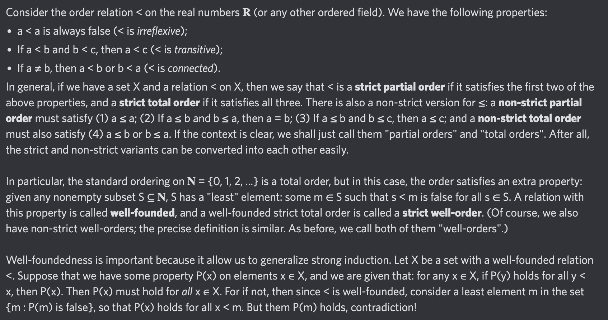

# Equation of The Day

# Day 64: [Well-order](https://en.wikipedia.org/wiki/Well-order)

$$\forall S\subseteq X,S\ne\varnothing\implies\exists m\in S,\forall s\in S,s\nless m$$

<picture></picture>

<a href="../0-63/0063.html">#63</a> $\qquad\leftarrow\qquad$ #64 (August 16, 2024)

[Back to Sector 2](../64-127.md)

