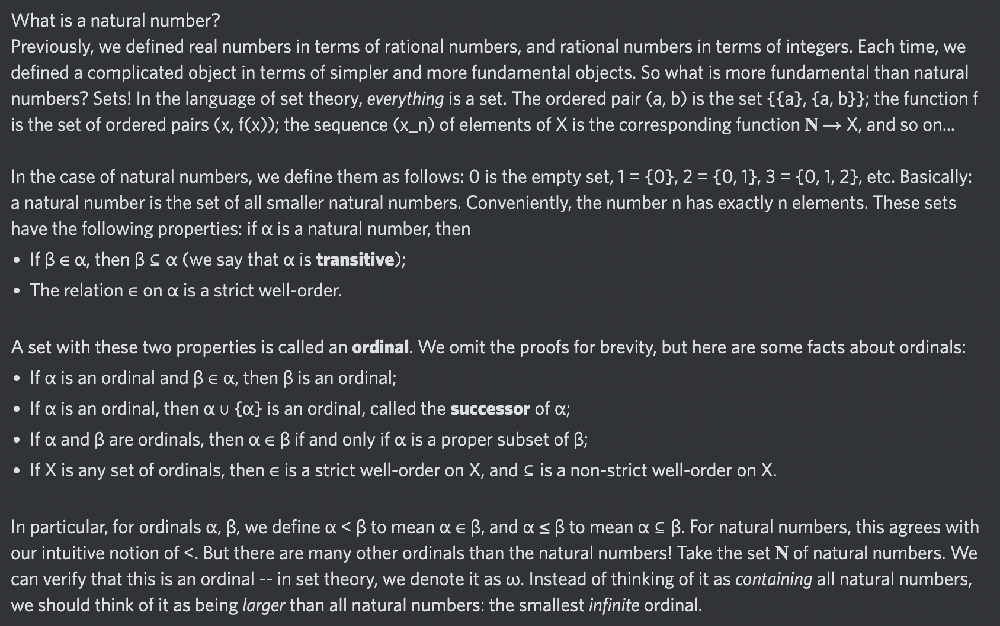

# Equation of The Day

# Day 65: [Ordinal](https://en.wikipedia.org/wiki/Ordinal_number)

$$\operatorname{WO}(\alpha,\in)\wedge\forall\beta\in\alpha,\beta\subseteq\alpha$$

<picture></picture>

<a href="0064.html">#64</a> $\qquad\leftarrow\qquad$ #65 (August 17, 2024) $\qquad\rightarrow\qquad$ <a href="0066.html">#66</a>

[Back to Sector 2](../64-127.md)

