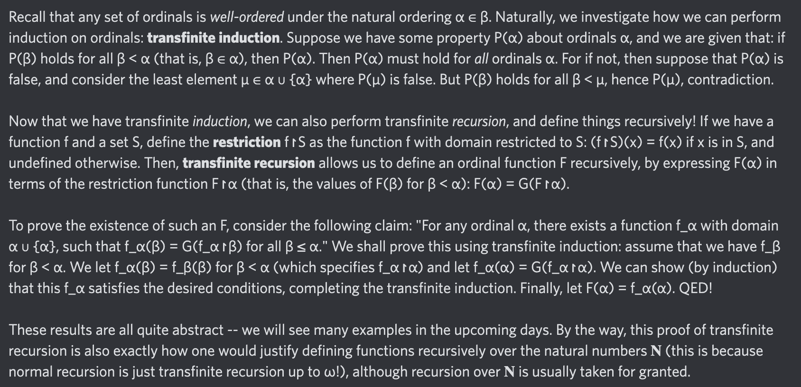

# Equation of The Day

# Day 66: [Transfinite recursion](https://en.wikipedia.org/wiki/Transfinite_induction)

$$F(\alpha)=G(F\upharpoonright\alpha)$$

<picture></picture>

<a href="0065.html">#65</a> $\qquad\leftarrow\qquad$ #66 (August 21, 2024)

[Back to Sector 2](../64-127.md)

