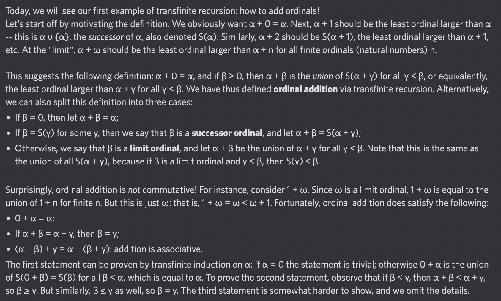

# Equation of The Day

# Day 67: [Ordinal arithmetic](https://en.wikipedia.org/wiki/Ordinal_arithmetic)

$$\alpha+\beta=\bigcup_{\gamma<\beta}S(\alpha+\gamma)$$

<picture></picture>

<a href="0066.html">#66</a> $\qquad\leftarrow\qquad$ #67 (August 22, 2024)

[Back to Sector 2](../64-127.md)

