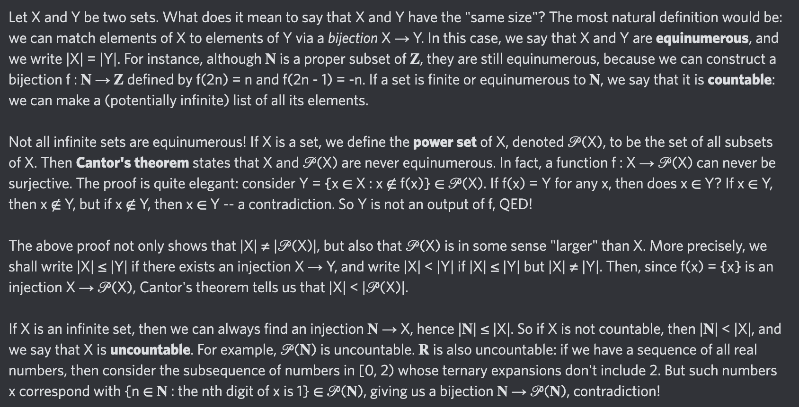

# Equation of The Day

# Day 69: [Cantor's theorem](https://en.wikipedia.org/wiki/Cantor's_theorem)

$$|X|<|\mathcal P(X)|$$

<picture></picture>

<a href="0068.html">#68</a> $\qquad\leftarrow\qquad$ #69 (August 27, 2024)

[Back to Sector 2](../64-127.md)

