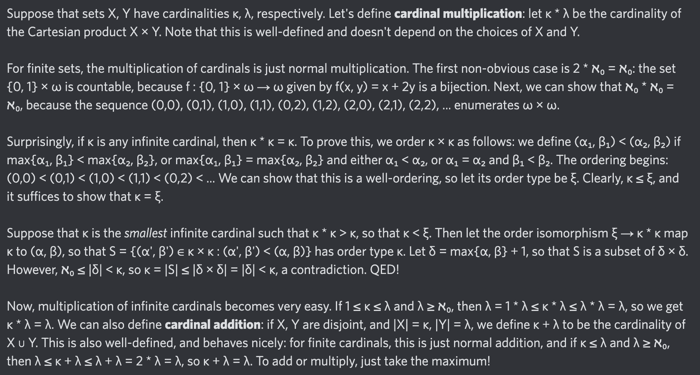

# Equation of The Day

# Day 71: [Cardinal arithmetic](https://en.wikipedia.org/wiki/Cardinal_number#Cardinal_arithmetic)

$$\kappa+\lambda=\kappa\cdot\lambda=\max\{\kappa,\lambda\}$$

<picture></picture>

<a href="0070.html">#70</a> $\qquad\leftarrow\qquad$ #71 (August 30, 2024)

[Back to Sector 2](../64-127.md)

