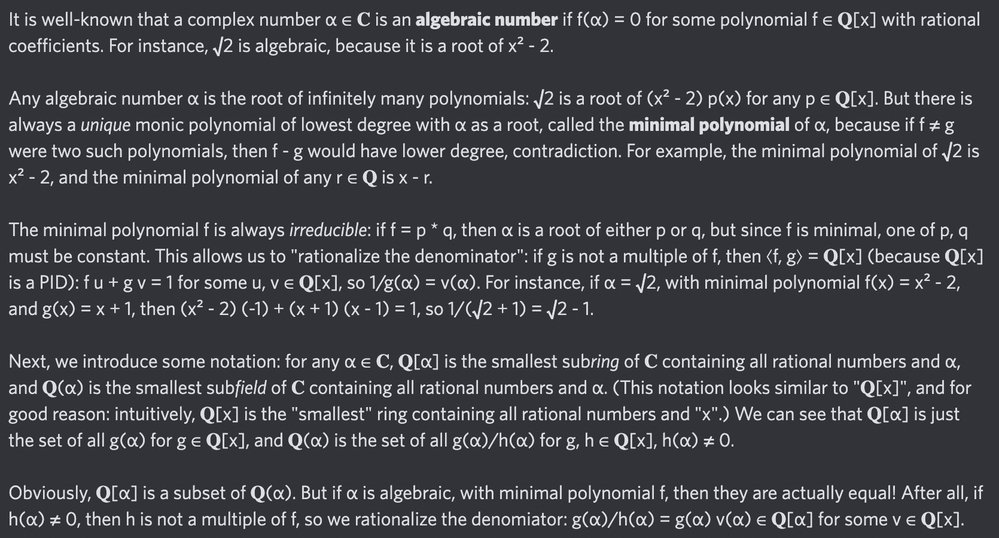

# Equation of The Day

# Day 72: [Minimal polynomial](https://en.wikipedia.org/wiki/Minimal_polynomial_(field_theory))

$$\mathbb Q(\alpha)=\mathbb Q[\alpha]$$

<picture></picture>

<a href="0071.html">#71</a> $\qquad\leftarrow\qquad$ #72 (September 5, 2024) $\qquad\rightarrow\qquad$ <a href="0073.html">#73</a>

[Back to Sector 2](../64-127.md)

