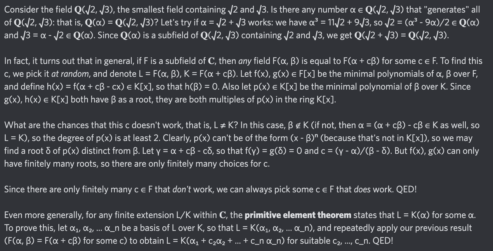

# Equation of The Day

# Day 75: [Primitive element theorem](https://en.wikipedia.org/wiki/Primitive_element_theorem)

$$\mathbb Q(\alpha,\beta)=\mathbb Q(\alpha+c\beta)$$

<picture></picture>

<a href="0074.html">#74</a> $\qquad\leftarrow\qquad$ #75 (September 23, 2024)

[Back to Sector 2](../64-127.md)

