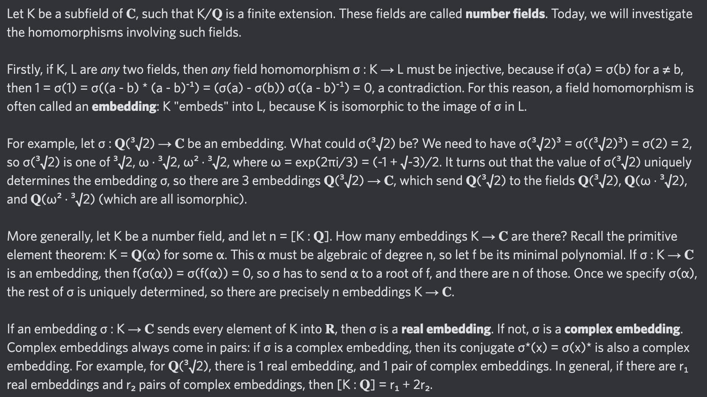

# Equation of The Day

# Day 76: [Real and complex embeddings](https://planetmath.org/realandcomplexembeddings)

$$[K:\mathbb Q]=r_1+2r_2$$

<picture></picture>

<a href="0075.html">#75</a> $\qquad\leftarrow\qquad$ #76 (October 16, 2024) $\qquad\rightarrow\qquad$ <a href="0077.html">#77</a>

[Back to Sector 2](../64-127.md)

