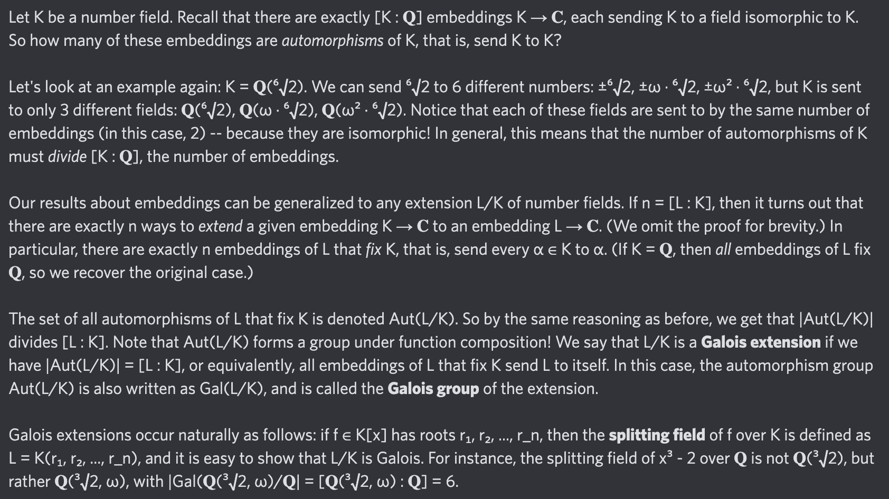

# Equation of The Day

# Day 77: [Galois extension](https://en.wikipedia.org/wiki/Galois_extension)

$$\left|\operatorname{Gal}(L/K)\right|=[L:K]$$

<picture></picture>

<a href="0076.html">#76</a> $\qquad\leftarrow\qquad$ #77 (October 20, 2024) $\qquad\rightarrow\qquad$ <a href="0078.html">#78</a>

[Back to Sector 2](../64-127.md)

