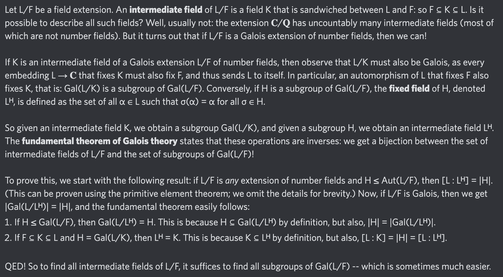

# Equation of The Day

# Day 78: [Fundamental theorem of Galois theory](https://en.wikipedia.org/wiki/Fundamental_theorem_of_Galois_theory)

$$\operatorname{Gal}(L/L^H)=H$$

<picture></picture>

<a href="0077.html">#77</a> $\qquad\leftarrow\qquad$ #78 (October 24, 2024) $\qquad\rightarrow\qquad$ <a href="0079.html">#79</a>

[Back to Sector 2](../64-127.md)

