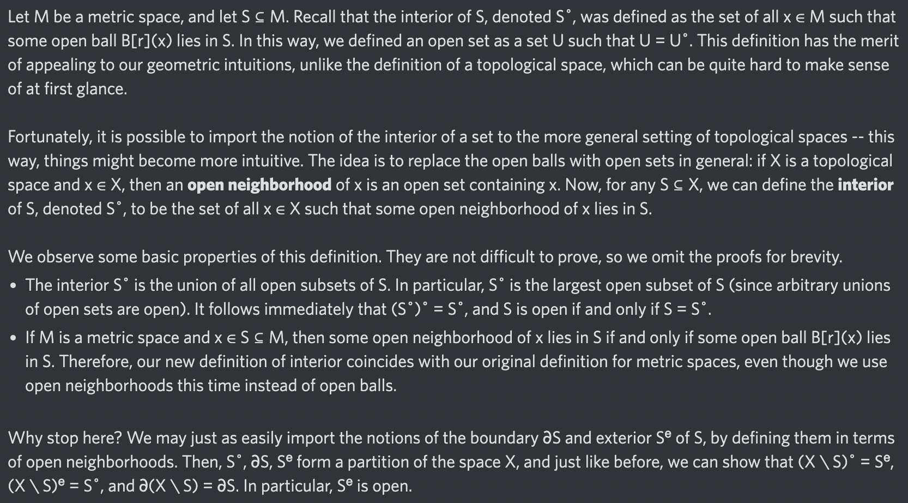

# Equation of The Day

# Day 82: [Interior](https://en.wikipedia.org/wiki/Interior_(topology)), part 2

$$S^\circ=\{x:\exists U\in\mathcal T, x\in U\subseteq S\}=\bigcup_{S\supseteq U\in\mathcal T}U$$

<picture></picture>

<a href="0081.html">#81</a> $\qquad\leftarrow\qquad$ #82 (December 19, 2024) $\qquad\rightarrow\qquad$ <a href="0083.html">#83</a>

[Back to Sector 2](../64-127.md)

