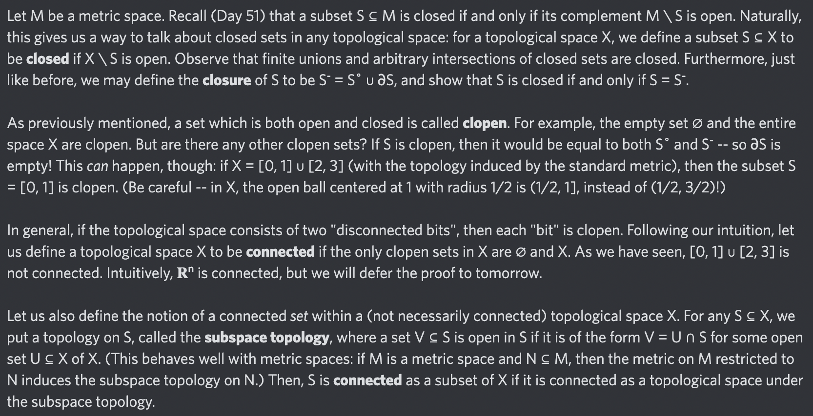

# Equation of The Day

# Day 83: [Connected space](https://en.wikipedia.org/wiki/Connected_space)

$$U,\ X\setminus U\in\mathcal T\implies U=\varnothing\text{ or }X$$

<picture></picture>

<a href="0082.html">#82</a> $\qquad\leftarrow\qquad$ #83 (January 2, 2025) $\qquad\rightarrow\qquad$ <a href="0084.html">#84</a>

[Back to Sector 2](../64-127.md)

