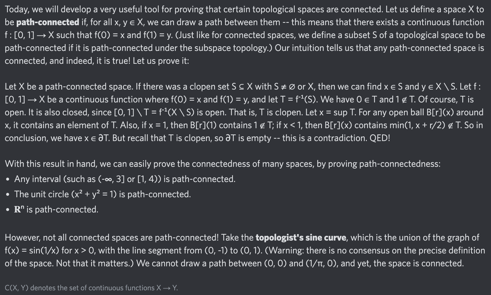

# Equation of The Day

# Day 84: [Path-connected space](https://en.wikipedia.org/wiki/Connected_space#Path_connectedness)

$$\forall x,y\in X,\exists f\in\mathcal C([0,1],X),f(0)=x\wedge f(1)=y$$

<picture></picture>

<a href="0083.html">#83</a> $\qquad\leftarrow\qquad$ #84 (January 4, 2025)

[Back to Sector 2](../64-127.md)

