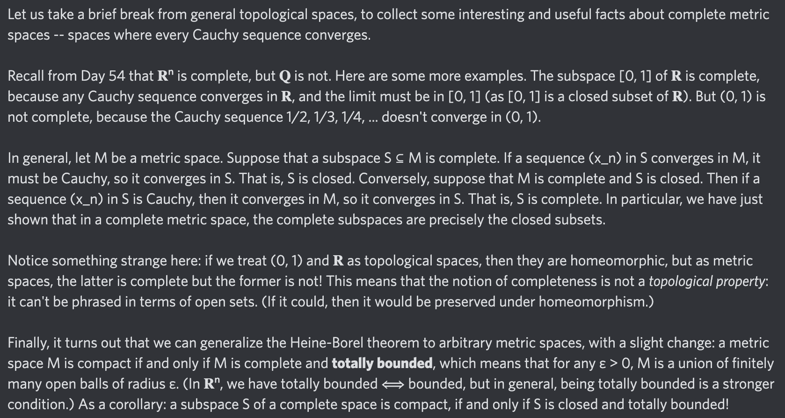

# Equation of The Day

# Day 85: [Complete metric space](https://en.wikipedia.org/wiki/Complete_metric_space), part 2

$$M\text{ complete}\implies\forall S\subseteq M(S\text{ complete}\iff S\text{ closed})$$

<picture></picture>

<a href="0084.html">#84</a> $\qquad\leftarrow\qquad$ #85 (February 3, 2025) $\qquad\rightarrow\qquad$ <a href="0086.html">#86</a>

[Back to Sector 2](../64-127.md)

